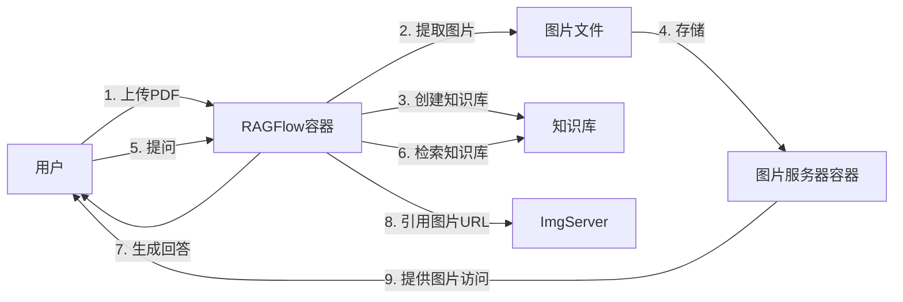
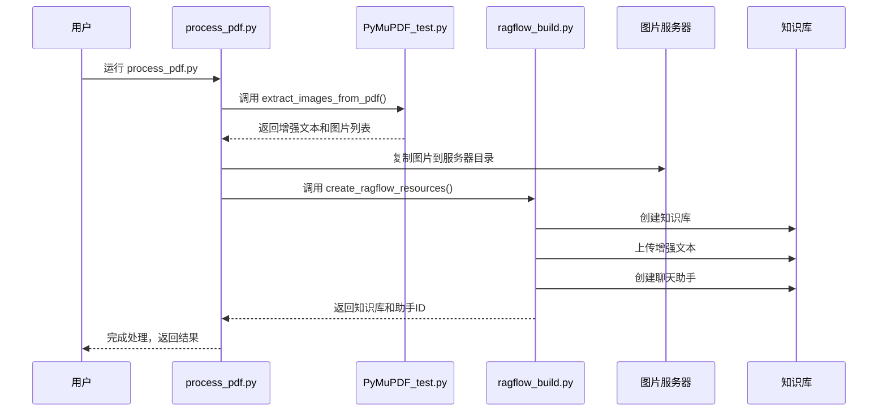
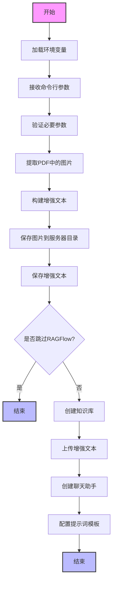

# RAGFlow图片服务方案 🖼️

<div align="center">
  
  <br>
  <p><strong>增强文档问答体验的图片服务解决方案</strong></p>
</div>

## 📋 项目背景

在使用 RAGFlow 框架进行文档问答时，原始文档中通常包含大量图片。为了在问答结果中正确显示这些图片，我们需要一种机制来提供图片的网络访问。本项目通过 MinerU 库提取PDF中的图片，并将其保存到 RAGFlow 的 MinIO 容器内。

## 🏗️ 系统架构

系统包含两个主要容器：
1. **MinerU **：用于提取PDF中的图片
2. **MinIO 存储**：提供图片资源的HTTP访问

RAGFlow可以通过服务器IP地址引用图片：`http://localhost/kb_id/file.jpg`



## 📁 项目文件说明

1. `ragflow_build.py`: RAGFlow知识库和聊天助手创建的核心功能
2. `process_pdf.py`: 整合所有功能的启动脚本
3. `Dockerfile`: 图片服务器的容器配置文件


## 🛠️ 环境准备

### 虚拟环境配置

推荐使用虚拟环境以避免依赖冲突：

```bash
# 创建虚拟环境，注意 python < 3.13
# 如果本地 python 版本不一致，可以用如下方式进行安装
# brew install pyenv
# pyenv install 3.10
# python3.10 -m venv venv
python -m venv venv

# 激活虚拟环境
# Windows
venv\Scripts\activate
# Linux/Mac
source venv/bin/activate

# 安装依赖包
pip install -r requirements.txt
```

### Docker配置
确保已安装Docker并正常运行。

### 环境变量配置
**重要**: 创建`.env`文件并配置必要参数：
```
RAGFLOW_API_KEY=您的RAGFlow API密钥 (从 RAGFlow API 处获取)
RAGFLOW_SERVER_IP=您的服务器IP地址 (从 RAGFlow API 处获取)
```


## 🚀 实现步骤

### 1. 在前端选择 PDF 文档 上传等到解析


### 4. 处理PDF文档

确保已经在`.env`文件中设置了必要的环境变量，然后运行PDF处理脚本：
```bash
python process_pdf.py demo.pdf
```

此脚本会自动执行以下操作：
1. 提取PDF中的图片
2. 将图片保存到图片服务器目录
3. 生成带有图片URL的增强文本
4. 创建RAGFlow知识库
5. 创建聊天助手

**参数说明**：
- 如果需要手动指定服务器IP，可以使用`--server_ip`参数：
  ```bash
  python process_pdf.py demo.pdf --server_ip 192.168.1.100
  ```



### 5. 测试问答功能

1. 访问RAGFlow Web界面（通常是 http://localhost:80）
2. 找到新创建的聊天助手（名称与PDF文件名相关）
3. 开始测试问答，验证回答中的图片是否正确显示


## 🖼️ 图片URL格式说明

本项目使用HTML的img标签格式来在RAGFlow中正确渲染图片。在最新版本中，图片URL使用服务器实际IP地址而不是localhost，这对于Docker容器间通信至关重要。

### 正确的图片格式示例:

```html

```

**注意**: 不要使用`localhost`或`127.0.0.1`作为图片URL中的主机地址，否则在RAGFlow容器中将无法正确解析。


## 📊 代码运行流程说明

1. `process_pdf.py`是主要的入口文件，它会按顺序调用：
   - `PyMuPDF_test.py`中的函数处理PDF和提取图片
   - `ragflow_build.py`中的函数创建知识库和聊天助手

2. 详细流程图：



## ⚠️ 注意事项

1. 确保图片服务器容器在RAGFlow容器之前启动
2. 图片名称会自动生成唯一标识，避免冲突
3. 图片会持久化存储在本地的`images`目录中
4. 请妥善保管RAGFlow API密钥
5. **重要**: 确保使用正确的服务器IP地址，否则图片将无法在RAGFlow聊天界面中显示

## 🔍 故障排除

如果遇到问题，请按以下顺序检查：

1. 容器状态：
   ```bash
   docker ps  # 检查两个容器是否都在运行
   ```

2. 网络连接：
   ```bash
   docker network inspect rag-network  # 检查网络连接状态
   ```

3. 图片服务器：
   ```bash
   docker logs image-server  # 检查服务器日志
   ls images  # 检查图片是否正确保存
   ```

4. 图片访问：
   - 通过浏览器访问 http://[您的IP]:8000 验证图片服务器
   - 检查生成的图片URL格式是否正确（应为 http://[您的IP]:8000/images/xxx.png）
   - 确认.env文件中的IP地址是否正确配置

5. RAGFlow API：
   - 确认API密钥设置正确
   - 检查RAGFlow服务是否正常运行

6. 图片显示问题：
   - 检查RAGFlow聊天界面网络请求，查看图片URL是否正确
   - 确认图片URL使用的是服务器IP而非localhost
   - 尝试手动在浏览器中访问图片URL验证图片是否可访问

如果仍然遇到问题，可以查看各个容器的日志：
```bash
docker logs ragflow-server
docker logs image-server
```